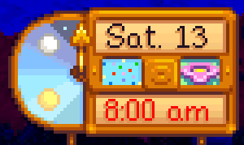

**Push NPCs** is a [Stardew Valley](http://stardewvalley.net/) mod that allows you to push NPCs.

> 

Compatible with Stardew Valley 1.3+ on Linux/Mac/Windows, both single-player and multiplayer.

## Contents
* [Install](#install)
* [Use](#use)
* [Configure](#configure)
* [Compatibility](#Compatibility)
* [See also](#see-also)

## Install
1. [Install the latest version of SMAPI](https://smapi.io/).
1. [Install this mod from Nexus mods](TODO: link).
1. Run the game using SMAPI.

## Use
Use ... to push NPCs.

## Compatibility
Push NPCs is compatible with Stardew Valley 1.3+ on Linux/Mac/Windows, both single-player and
multiplayer.

In multiplayer mode, any player with Push NPCs installed can .... Players without
it will .... If the main player doesn't have it installed, they'll ....

## See also
* [release notes](release-notes.md)
* [Nexus mod](TODO: link)
* [Discussion thread](http://community.playstarbound.com/threads/...)
